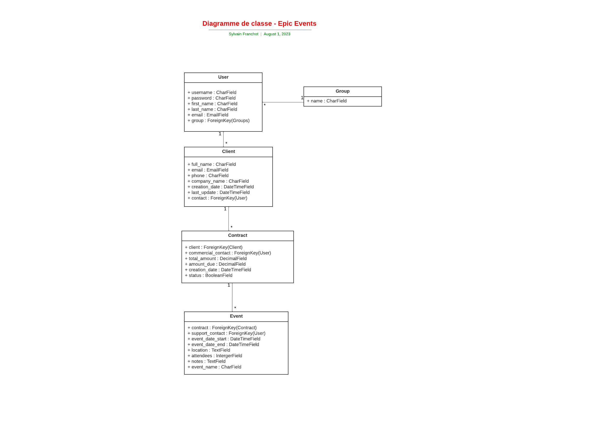

# Projet Epic Events CRM

Epic Events CRM est une application en ligne de commande Python destinée à améliorer la gestion de la relation client (CRM) pour l'entreprise Epic Events. Cette application vise à faciliter la collecte, le traitement et le partage d'informations client pour l'organisation d'événements.

Cette application a été réalisée en trois parties :

1. Utilisation de Django ORM qui gère les interactions avec une base de données PostgreSQL.
2. Utilisation de Django REST qui a été utilisé pour la construction de l'API et la gestion des permissions utilisateurs.
3. Cette dernière partie intègre une application en ligne de commande (CLI) permettant l'interaction de l'utilisateur avec l'API.

## Installation

### Prérequis

* Python 3.9 ou une version plus récente.

### Étapes d'installation

1. Clonez le répertoire GitHub sur votre machine locale :

    ```
    git clone https://github.com/SylvOne/projet12.git
    ```

2. Allez dans le dossier du projet :
    ```
    cd projet12
    ```

3. Créez un environnement virtuel avec la commande :
    ```
    python -m venv venv sur Windows 
    ou python3 -m venv venv sur Linux/Mac.
    ```

4. Activez l'environnement virtuel avec la commande :
    ```
    source venv/bin/activate sur Linux/Mac 
    ou .\venv\scripts\activate sur Windows.
    ```

5. Installez les dépendances :
    ```
    pip install -r requirements.txt
    ```

6. Créez un fichier .env à la racine du projet et stockez les variables d'environnements SECRET_KEY et SENTRY_DSN :
    ```
    SECRET_KEY="your_django_secret_key"
    SENTRY_DSN=https://your_sentry_DNS
    ```

## Execution du serveur
Commencez par configurer votre base de données PostgreSQL à l'aide de l'outil PgAdmin, que vous pouvez obtenir à partir de "l'EDB Installer".

La première étape consiste à créer un serveur local. Nommez-le "localhost" et utilisez le port par défaut "5432". Par la suite, vous devrez créer un utilisateur ainsi qu'une base de données.

Après avoir terminé la configuration de votre base de données PostgreSQL, dirigez-vous vers les paramètres de notre application Django. Vous les trouverez dans le fichier "settings.py".

Enfin, remplissez les informations concernant votre base de données dans la section DATABASES.
```
DATABASES = {
    'default': {
        'ENGINE': 'django.db.backends.postgresql',
        'NAME': 'name_database',
        'USER': 'username',
        'PASSWORD': 'mdp_admin',
        'HOST': 'localhost',
        'PORT': '5432',
    }
}
```

### Lancement du serveur

Dans votre terminal :

* Soyez sûr d'être à la racine du projet

```
cd projet12
```

* Réalisez les migrations
  
  ```
  python manage.py makemigrations
  ```
puis 

```
python manage.py migrate
```

Maintenant le serveur est prêt pour être lancé

```
python manage.py runserver 
```

Vous devriez voir cette ligne dans votre terminal

```
Starting development server at http://127.0.0.1:8000/
```

## Création du super utilisateur

Pour créer un superutilisateur (ou "superuser") avec Django, suivez les étapes ci-dessous :

## Étapes

1. **Ouvrez un terminal** - Vous pouvez le faire en cherchant "terminal" sur votre ordinateur ou en ouvrant un invite de commande si vous êtes sur Windows.

2. **Placez-vous à la racine de votre projet Django ( projet12)** - Au besoin utilisez la commande `cd` pour changer de répertoire.

3. **Activez votre environnement virtuel si ce n'est pas déjà fait comme expliqué précedemment**

4. **Exécutez la commande `createsuperuser`** - Faites cela en tapant : 
   ```
   python manage.py createsuperuser
   ``` 
   dans le terminal et en appuyant sur "Enter".

Ensuite, Django vous invitera à entrer un nom d'utilisateur, une adresse e-mail et un mot de passe pour le nouveau superutilisateur. Une fois que vous aurez saisi ces informations, le superutilisateur sera créé.

_Remarque_ : Cette opération ne nécessite pas que le serveur Django soit en cours d'exécution.

## Création des groupes utilisateurs

Pour que l'application fonctionne correctement vous allez devoir créer 3 groupes correspondants aux départements Gestion, Commercial, et Support.

* Ouvrez un terminal à la racine du projet12, et tapez la commande suivante :
   
   ``` 
   python manage.py create_groups
   ``` 
Cela créera les groupes "Commercial", "Gestion" et "Support".

## Création des utilisateurs

* Ensuite vous allez devoir exécuter cette commande :

    ``` 
   python manage.py create_users
   ``` 

Cela créera les utilisateurs "userCommercial", "userGestion" et "userSupport", et les ajoutera à leurs groupes respectifs. Les mots de passes respectifs sont "passwordcomm", "passwordgest", "passwordsupp".

_Remarque_ : La création des groupes et des utilisateurs aurait pu se faire via l'interface d'administration de Django, mais pour plus de simplicité pour tester l'application, j'ai préparé ces 2 fichiers de commandes personnalisées.

## Documentation de l'API et schéma de la base de données

La documentation de l'API est accessible ici :
[Documentation API](https://documenter.getpostman.com/view/17650939/2s9XxsWcSL)

Le schéma de la base de données est accessible ici :


## Connexion à l'interface d'administration Django

Rendez-vous sur ce lien : http://127.0.0.1:8000/admin/

Vous pourrez vous connecter avec votre username et mot de passe utilisés lors de la création du super utilisateur.

Seul le super utilisateur à accès à l'interface d'administration, il dispose via cette interface de toutes les droits.

## Interface en ligne de commande (CLI)

Le autres utilisateurs pourront se connecter et interagir avec l'application via l'interface CLI.

## Commandes CLI

Voici une liste de toutes les commandes CLI disponibles pour l'application :

* `login`: Authentifie un utilisateur.
    * `--username`: (Requis) Nom d'utilisateur pour l'authentification.

* `logout`: Déconnecte l'utilisateur actuellement connecté.

<u>Ces commandes sont uniquement accessibles au groupe Gestion</u>

* `create_user`: Crée un nouvel utilisateur.
    * `--username`: (Requis) Nom d'utilisateur pour le nouvel utilisateur.
    * `--email`: (Requis) Email pour le nouvel utilisateur.
    * `--first_name`: (Requis) Prénom pour le nouvel utilisateur.
    * `--last_name`: (Requis) Nom de famille pour le nouvel utilisateur.
    * `--group`: (Requis) Groupe pour le nouvel utilisateur.

* `update_user`: Met à jour un utilisateur existant.
    * `--username`: (Requis) Nom d'utilisateur de l'utilisateur à mettre à jour.
    * `--new_username`: Nouveau nom d'utilisateur pour l'utilisateur.
    * `--password`: Nouveau mot de passe pour l'utilisateur.
    * `--email`: Nouvel email pour l'utilisateur.
    * `--first_name`: Nouveau prénom pour l'utilisateur.
    * `--last_name`: Nouveau nom de famille pour l'utilisateur.
    * `--group`: Nouveau groupe pour l'utilisateur.

* `delete_user`: Supprime un utilisateur.
    * `--username`: (Requis) Nom d'utilisateur de l'utilisateur à supprimer.

<u>Note : Les commandes clients ( create et update ) sont uniquement accessibles au groupe Commercial</u>

* `clients`: Commandes liées aux clients.
    * `action`: (Requis) Action à effectuer ('create', 'update', 'list').
    * `--full_name`: Nom complet du client.
    * `--email`: Email du client.
    * `--phone`: Numéro de téléphone du client.
    * `--company_name`: Nom de l'entreprise du client.
    * `--client_email`: Email du client à mettre à jour.
    * `--filters`: Filtres à appliquer lors de l'affichage de la liste des clients.

<u>Note : La commande contracts (create) est uniquement accessible au groupe Gestion et la commande contracts (update) est accessible au groupe Gestion et Commercial ( uniquement si l'utilisateur commercial est le contact du client dont dépend le contrat )</u>

* `contracts`: Commandes liées aux contrats.
    * `action`: (Requis) Action à effectuer ('create', 'update', 'list', 'update_status').
    * `--contract_id`: ID du contrat.
    * `--client_email`: Email du client lié au contrat.
    * `--total_amount`: Montant total du contrat.
    * `--amount_due`: Montant dû sur le contrat.
    * `--filters`: Filtres à appliquer lors de l'affichage de la liste des contrats.
    * `--status`: État de la signature du contrat.

<u>Note : La commande clients ( create ) est uniquement accessible au groupe Commercial, mais le commercial doit être le contact du client concerné par l'évènement. La commande clients ( update ) est accessible au groupe Gestion, et au groupe Support seulement si l'utilisateur (Support) est associé à l'évènement qu'il veut de modifier en tant que "support contact"</u>

* `events`: Commandes liées aux événements.
    * `action`: (Requis) Action à effectuer ('create', 'assign_support', 'list', 'update', 'no_support_contact').
    * `--event_name`: Nom de l'événement.
    * `--contract_id`: ID du contrat lié à l'événement.
    * `--event_date_start`: Date de début de l'événement.
    * `--event_date_end`: Date de fin de l'événement.
    * `--location`: Lieu de l'événement.
    * `--attendees`: Nombre de participants à l'événement.
    * `--notes`: Notes sur l'événement.
    * `--filters`: Filtres à appliquer lors de l'affichage de la liste des événements.
    * `--event_id`: ID de l'événement.
    * `--support_contact_username`: Nom d'utilisateur du contact de support à attribuer à un événement.
    * `--new_event_name`: Nouveau nom de l'événement.
    * `--new_contract_id`: Nouvel ID de contrat pour l'événement.
    * `--new_event_date_start`: Nouvelle date de début pour l'événement.
    * `--new_event_date_end`: Nouvelle date de fin pour l'événement.
    * `--new_location`: Nouveau lieu pour l'événement.
    * `--new_attendees`: Nouveau nombre de participants à l'événement.
    * `--new_notes`: Nouvelles notes pour l'événement.


Ces permissions ont été définies conformément au cahier des charges :

```
Besoins et fonctionnalités

"Besoins généraux"

● Chaque collaborateur doit avoir ses identifiants pour utiliser la
plateforme.

● Chaque collaborateur est associé à un rôle (suivant son
département).

● La plateforme doit permettre de stocker et de mettre à jour les
informations sur les clients, les contrats et les événements.

● Tous les collaborateurs doivent pouvoir accéder à tous les clients,
contrats et événements en lecture seule.


"Besoins individuels : équipe de gestion"

● Créer, mettre à jour et supprimer des collaborateurs dans le
système CRM.

● Créer et modifier tous les contrats.

● Filtrer l’affichage des événements, par exemple : afficher tous les
événements qui n’ont pas de « support » associé.

● Modifier des événements (pour associer un collaborateur support à
l’événement).


"Besoins individuels : équipe commerciale"

● Créer des clients (le client leur sera automatiquement associé).

● Mettre à jour les clients dont ils sont responsables.

● Modifier/mettre à jour les contrats des clients dont ils sont
responsables.

● Filtrer l’affichage des contrats, par exemple : afficher tous les
contrats qui ne sont pas encore signés, ou qui ne sont pas encore
entièrement payés.

● Créer un événement pour un de leurs clients qui a signé un
contrat.


"Besoins individuels : équipe support"

● Filtrer l’affichage des événements, par exemple : afficher
uniquement les événements qui leur sont attribués.
● Mettre à jour les événements dont ils sont responsables.
```

## Voici un exemple de mise en situation via l'interface CLI :

Vous devrez vous placez dans le dossier epic_events/cli/views du projet12

### Gestion des utilisateurs

* <b>Connexion</b>
  
Peu importe la commande que vous souhaitez utiliser vous devrez vous connecter et avoir les droits nécéssaires pour utiliser une commande.

```
python cli.py login --username "userGestion"
```


* <b>Créer un nouvel utilisateur ( groupe Gestion uniquement )</b>

```
python cli.py create_user --username pascalusername --email newuser@example.com --first_name Pascal --last_name Nomdepascal --group Commercial
```

* <b>Mettre à jour un utilisateur existant ( groupe Gestion uniquement ) :</b>

```
python cli.py update_user --username pascalusername --new_username pascalusername --email emailmisajour@example.com --first_name Pascal --last_name Nomdepascal --group Commercial
```

* <b>Supprimer un utilisateur existant ( groupe Gestion uniquement ) :</b>

```
python cli.py delete_user --username username
```

### Gestion des clients

* <b>Connexion</b>

```
python cli.py login --username "userCommercial"
```

* <b>Créer un client ( groupe Commercial uniquement ) :</b>

```
python cli.py clients create --full_name "nomclien prenomclient" --email client@email.com --phone 1234567890 --company_name "Company"
```

* <b>Mettre à jour un client ( groupe Commercial uniquement si le commercial est contact du client ) :</b>

```
python cli.py clients update --full_name "Updated Client Name" --email updated_client@email.com --phone 9876543210 --company_name "Updated Company" --client_email client@email.com
```
* <b>Liste filtrée de clients  ( accessible à tous les groupes ) :</b>

```
python cli.py clients list --filters name="Updated Client Name" email=updated_client@email.com
```

### Gestion des contrats

* <b>Connexion</b>

```
python cli.py login --username "userGestion"
```

* <b>Créer un contrat ( accessible uniquement au groupe Gestion ) :</b>

```
python cli.py contracts create --client_email updated_client@email.com --total_amount 1000.50 --amount_due 500.25
```

* <b>Mettre à jour un contrat ( accessible au groupe Gestion et au groupe Commercial uniquement si le commercial est le contact commercial du client ) :</b>

```
python cli.py contracts update --contract_id 15 --client_email updated_client@email.com --total_amount 2000.00 --amount_due 1000.00
```

* <b>Mise à jour du contrat après signature du client ( accessible au groupe Gestion et au groupe Commercial uniquement si le commercial est le contact commercial du client ) :</b>

```
python cli.py contracts update_status --contract_id 15 --status true
```

* <b>Liste filtrée de contrats ( accessible à tous les groupes ) :</b>

Filtre tous les contrats avec un montant restant à payer supérieur à 500. 
```
python cli.py contracts list --filters amount_due_gt=500
```
Filtre tous les contrats non signé. 
```
python cli.py contracts list --filters status=false
```

### Gestion des évènements

* <b>Connexion</b>

```
python cli.py login --username "userCommercial"
```

* <b>Créer un évènement ( accessible uniquement au groupe Commercial seulement si le commercial est le contact commercial du client dont dépend l'évènement ) :</b>

Attention le contrat doit être signé pour pouvoir créer un évènement.

```
python cli.py events create --event_name "New Event for test" --contract_id 15 --event_date_start "01-07-2023" --event_date_end "02-07-2023" --location "Location" --attendees 50 --notes "This is a note"
```

* <b>Connexion</b>

```
python cli.py login --username "userGestion"
```


* <b>Assignation d'un membre de l'équipe Support à l'évènement ( accessible uniquement au groupe Gestion ) :</b>


```
python cli.py events assign_support --event_id 5 --support_contact_username userSupport
```

* <b> Liste filtrée d'événements : ( accessible à tous les groupes ) :</b>

* liste des évènements ayant pour contact support l'utilisateur userSupport2

```
python cli.py events list --filters support_contact__username=userSupport2
```

* liste des évènements n'ayant pas de membre support associé

```
python cli.py events no_support_contact
```

### Deconnexion
* liste des évènements n'ayant pas de membre support associé

```
python cli.py logout
```
